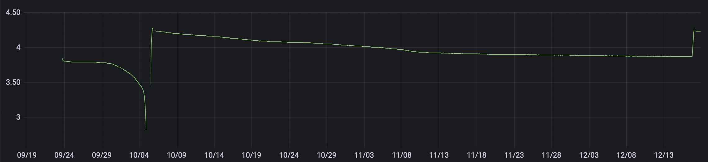

# BeetleWatcher
 
## Idee
BeetleWatcher misst die Temperatur und Luftfeuchtigkeit und berechnet daraus die Taupunkttemperatur
Alle Messwerte werden mitteles WIFI an einen MQTT-Server übertragen.
Die Übertagung wird in unter einer Sekunde duchgeführt, so dass ein Akkubetrieb möglich ist.

## Hardware
* FireBeetle ESP32 IoT Microcontroller (https://www.dfrobot.com)
* DHT22 Temperature & Humidity Sensor (https://www.dfrobot.com)
* Lipo Akku 1s 3,7V 2000mAh JST PH Stecker (https://www.amazon.de)

## Akkubetrieb
Um die Batteriespannung zu messen müssen zwei Lötbrücken angebracht werden.
Mit dem 2000mAh Akku lassen sich 2-3 Monate alle drei Minuten Meswwerte aufnehmen.

## Aufbau
Der Senser wird an IO27/D4 sowie and der Spannungsversorgung angeschlossen.
Der Akku kann über den USB - Stecker geladen werden.

